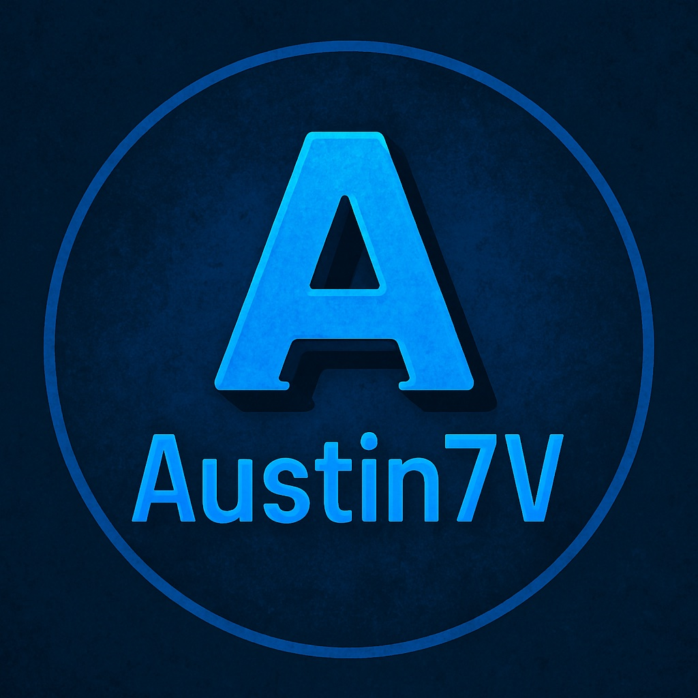

# :wave: Hallo, ich bin Sergey (Austin7V)

### Willkommen auf meinem GitHub-Profil!
#### Ich bin ein angehender <bold>Full-stack Web Developer<bold>, der leidenschaftlich gerne digitale Lösungen baut von modernen Web-Apps bis hin zu KI-gestützten Tools und No-Code-Automatisierungen.

### :rocket: Was mich motiviert
#### -ständig etwas Neues zu lernen   -komplexe Dinge einfach zu machen   -sinnville digitale Produkte zu entwickeln   -Menschen durch Technologie weiterzubringen

### 🛠️ Technologien & Interessen
#### -Frontend: HTML/CSS/JavaScript/React/Next.JavaScrip   -Backend: Node.js/MongoDB/REST APIs   -Tools: Git/GitHub/VS Code/Terminal   -Interessen: KI, Automastisierung, No-Code/Low-Code, Full-Stack Development 0-100%

### 🌍 Über mich
#### Ich lebe in Deutschland seit über 16 Jahren, spreche fließend Deutsch und arbeite darauf hin, ein professioneller Entwickler zu werden. 
#### Mein Ziel: Remote arbeiten, starke Projekte bauen und meine Zukunft in der digitalen Welt gestalten.

### 📬 Kontakt
#### Wenn du gemeinsam an Projekten arbeiten möchtest oder Ideen für Kooperationen hast schreib mit gerne! GitHub/Discord/LinedIn